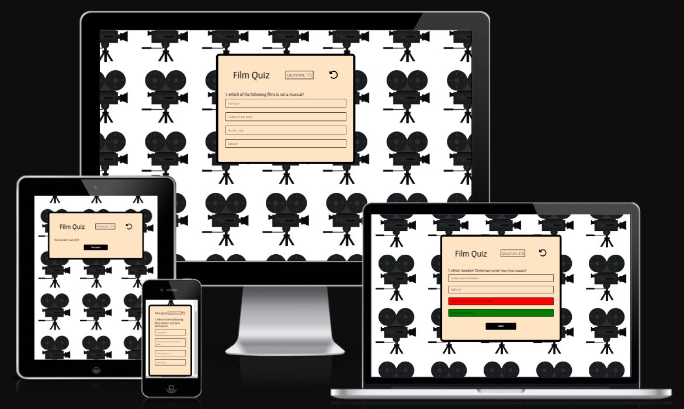
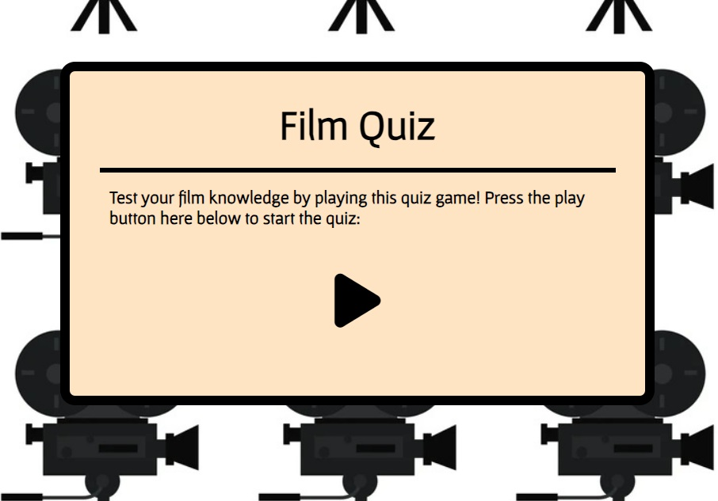
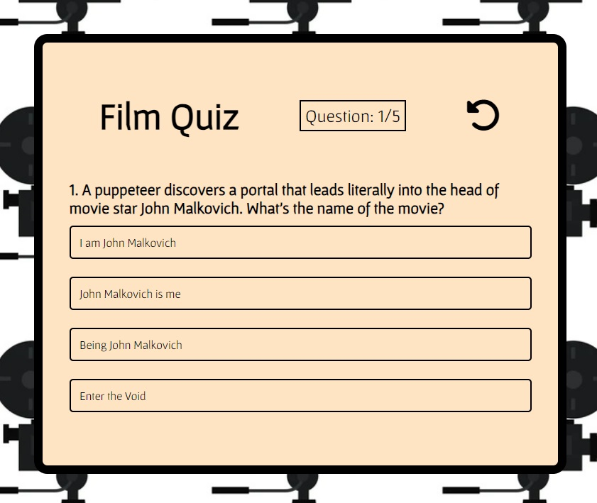
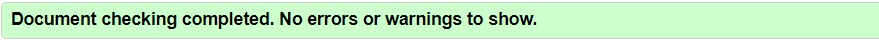
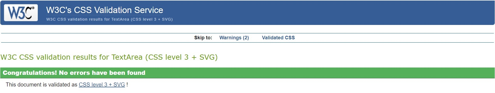
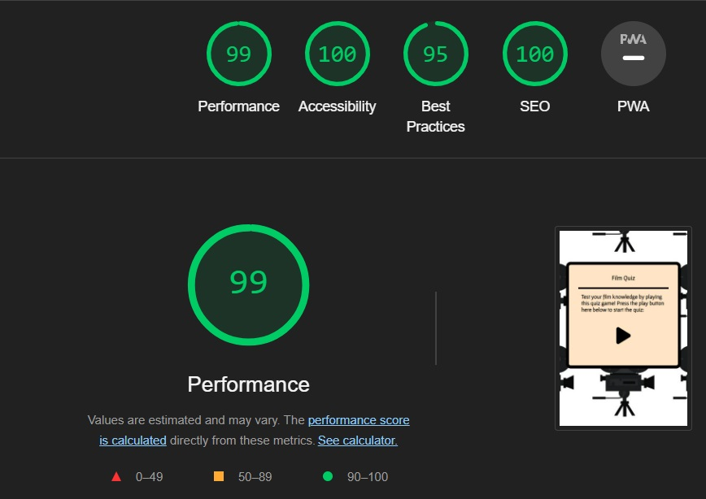
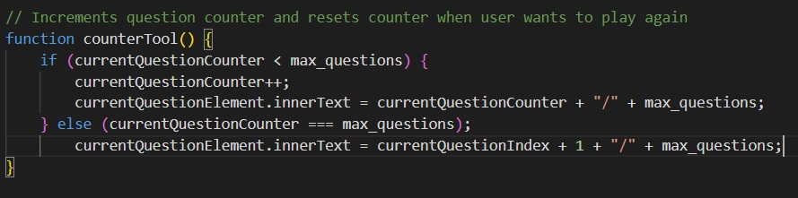

# Film Quiz

[The actual website](https://merin86.github.io/film-quiz/)

This is a film quiz with an American focus. These are mainly questions about blockbusters, so the user has the opportunity to test their knowledge of film history.

The users of this website get to learn some film facts in an entertaining way. The game is made for adults.

## Content index

* [Features](#features)
* [Design](#design)
* [Technologies Used](#technologies-used)
* [Testing](#testing)
* [Deployment](#deployment)
* [Credits](#credits)

## Features

-   Front Page

    - Before the user starts the game, a front page with a background on the movie theme is visible. Here you can see a title and a short text about what the game is about and how to start it.

    

-   Started Quiz

    - After the user presses the play button, the game appears. The user presses one of the four answer options and if the button turns green, the user has answered correctly. Otherwise, it will be red. Above the questions is a counter that tells you which question you are on. There is also a return button that takes the user back to the front page. After answering five questions, a message pops up revealing how many points the user got. A button will also appear that says "Play Again".

    

### Features Left to Implement

-   It would be good to add a scoreboard, next to the counter so that the user can see how many points you have during the game.

## Technologies Used

### Languages Used

-   [HTML5](https://en.wikipedia.org/wiki/HTML5)
-   [CSS3](https://en.wikipedia.org/wiki/Cascading_Style_Sheets)
-   [JavaScript](https://en.wikipedia.org/wiki/JavaScript)

### Frameworks, Libraries & Programs Used

-   [Google Fonts](https://fonts.google.com/)
-   [Font Awesome](https://fontawesome.com/)
-   GitPod
-   [GitHub](https://github.com/)
-   [TinyPNG](https://tinypng.com/)

## Testing

-   I tested playing this game in different browsers: Chrome, FIrefox, Mi, Safari.
-   I confirmed that the game results are always correct.
-   The website is responsive.

### Validator Testing

- HTML Validator
    - result for index.html
    

- CSS Validator
    - result for style.css
    

- JSHint Validator
    - result from JSHint shows 27 warnings:
        - 'let' is available in ES6 (use 'esversion: 6'). This warning consists of 7 of these alerts.
        - 'const' is available in ES6 (use 'esversion: 6'). This warning consists of 13 of these alerts.
        - 'arrow function syntax (=>)' is only available in ES6 (use 'esversion: 6'). This warning consists of 4 of these alerts.
        - A leading decimal point can be confused with a dot: '.5'. This warning consists of 1 of these alerts.
        - 'template literal syntax' is only available in ES6 (use 'esversion: 6'). This warning consists of 1 of these alerts.
        - Expected an assignment or function call and instead saw an expression. This warning is a bug that I will talk about further down the page.

- Accessibility
    - Accessibility has reached 100%, after testing through Lighthouse under DevTools.
    

### Unfixed Bugs

- In my JavaScript there is a function called counterTool that increments question counter and resets counter when user wants to play again. First I only used an "if"-statement, but then the counter went up to 5/5 and then stops there, despite pressing "Play Again". I tried for a long time to fix this bug in different ways and finally I solved it with an "else" statement. This solution is probably not ideal, but at least now the function works as it should.

## Deployment

- The site was deployed to GitHub pages. The steps to deploy are as follows:
    - In the GitHub repository, navigate to the Settings tab, then choose Pages from the left hand menu.
    - From the source section drop-down menu, select the Master Branch.
    - Once the master branch has been selected, the page will be automatically refreshed with a detailed ribbon display to indicate the successful deployment.
    - Any changes pushed to the master branch will take effect on the live project.

  The live link can be found here - [Film Quiz](https://merin86.github.io/film-quiz/)

## Credits

### Content
- All content was written by the developer

### Code
- The structure of the website is taken from a [YouTube tutorial](https://www.youtube.com/watch?v=PBcqGxrr9g8). Most of the code have been copied from there in the begining of the project, and then alternated to fit this website. When the structure was set, the developer started to create own functions and model in the structure. The developer needed to use this tutorial as a template to get started with his own coding.
- The following previous PP2 project has been used as a source of inspiration for the website: [Mixtape-Quiz](https://siobhanlgorman.github.io/80s-Mixtape-Quiz/index.html)
- The following web page has been used as a learning tool and source of inspiration to create own codes for the website: [W3Schools](https://www.w3schools.com/)
- The following web page was used to add the return-btn function on the website: [Sentry](https://sentry.io/welcome/)

### Media
- The icons on the website were taken from [Font Awesome](https://fontawesome.com/)
- The fonts used were imported from [Google Fonts](https://fonts.google.com/)
- IMDb has sometimes been used as a source of facts regarding the information in the questions [IMBd](https://www.imdb.com/)

### Acknowledgment

- I would like to thank my coursemate "Jörgen _5P", with whom I had a lot of contact during the process to resolve various issues and complications that arose.